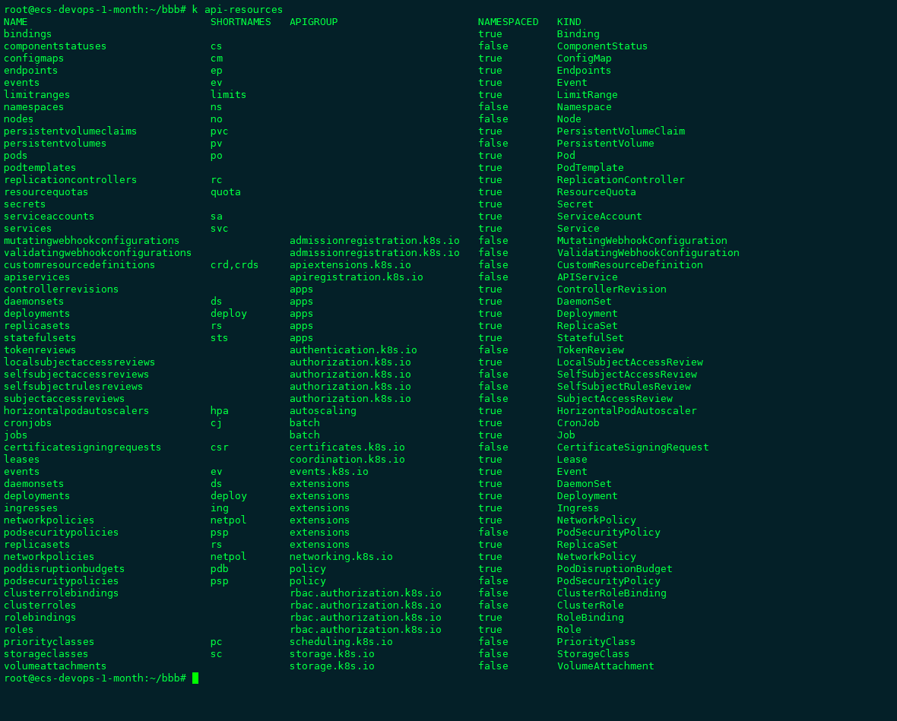

---
layout: post
title:  " yaml crash course "

categories: jekyll update
---


# YAML crash course 

yaml文件的结构：

```
apiVersion:
kind:
metadata:
spec:

```

查看资源类型：

```
 k api-resources
```




## apiVersion

###  pod
```
k explain pod.apiVersion --recursive
```

```
KIND:     Pod
VERSION:  v1

FIELD:    apiVersion <string>

DESCRIPTION:
     APIVersion defines the versioned schema of this representation of an
     object. Servers should convert recognized schemas to the latest internal
     value, and may reject unrecognized values. More info:
     https://git.k8s.io/community/contributors/devel/api-conventions.md#resources

```

### job

```
k explain job.apiVersion --recursive 
```

```
KIND:     Job
VERSION:  batch/v1

FIELD:    apiVersion <string>

DESCRIPTION:
     APIVersion defines the versioned schema of this representation of an
     object. Servers should convert recognized schemas to the latest internal
     value, and may reject unrecognized values. More info:
     https://git.k8s.io/community/contributors/devel/api-conventions.md#resources
```

## kind


```
k explain pod.kind

k explain job.kind

k explain deploy.kind

```


## metadata

```
k explain pod.metadata --recursive |less
```


```
KIND:     Pod
VERSION:  v1

RESOURCE: metadata <Object>

DESCRIPTION:
     Standard object's metadata. More info:
     https://git.k8s.io/community/contributors/devel/api-conventions.md#metadata

     ObjectMeta is metadata that all persisted resources must have, which
     includes all objects users must create.

FIELDS:
   annotations  <map[string]string>
   clusterName  <string>
   creationTimestamp    <string>
   deletionGracePeriodSeconds   <integer>
   deletionTimestamp    <string>
   finalizers   <[]string>
   generateName <string>
   generation   <integer>
   initializers <Object>
      pending   <[]Object>
         name   <string>
      result    <Object>
         apiVersion     <string>
         code   <integer>
         details        <Object>
            causes      <[]Object>
               field    <string>
               message  <string>
               reason   <string>
            group       <string>
            kind        <string>
            name        <string>
            retryAfterSeconds   <integer>
            uid <string>
         kind   <string>
         message        <string>
         metadata       <Object>
            continue    <string>
            resourceVersion     <string>
            selfLink    <string>
         reason <string>
         status <string>
   labels       <map[string]string>
   name <string>
   namespace    <string>
   ownerReferences      <[]Object>
      apiVersion        <string>
      blockOwnerDeletion        <boolean>
      controller        <boolean>
      kind      <string>
      name      <string>
      uid       <string>
   resourceVersion      <string>
   selfLink     <string>
   uid  <string>

```

## spec

```
k explain pod.spec --recursive |less
```

# final yaml 

```
apiVersion: v1
kind: Pod
metadata:
 name: coffee-app01
 labels:
  app: frontend
  run: coffee-app01
spec:
 containers:
 - name: demo-coffee
   image: ansilh/demo-coffee

```
## Ports in Service Objects


## port  in  kubectl 


```
 --port=80 

 --target-port=9090  

 --type=NodePort
```


#### nodePort
#### port
#### targetPort


