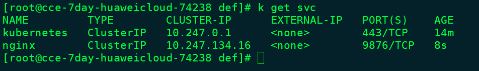

#  Port in kubectl run


```
kubectl run  --port=80


kubectl run  --port=80  --expose


```


## ClusterIP

```
k run nginx --image=nginx --replicas=3   --port=80
k expose deployment nginx --type=ClusterIP --port=9876

k get svc
```



```
k run busybox --image=busybox --restart=Never  --rm -it -- sh

wget -O- 10.247.134.16  

无法访问

```
**k expose deployment nginx --type=ClusterIP --port=9876 增加 --target-port=80, 则可以真长访问**


**用法总结：**

如果Pod端口和Service一致，则直接用 

```
k run nginx --image=nginx --replicas=3   --port=80 --expose

k run tomcat--image=tomcat--replicas=3   --port=8080  --expose
```
来搞一个deploy &  service ,

否则：
用两句话来实现：


```
k run nginx --image=nginx --replicas=3

k run tomcat --image=nginx --replicas=3

```


```
k expose deploy nginx --name=nginx-svc  --type=ClusterIP  --port=9876 --target=80

k expose deploy tomcat --name=tomcat -svc  --type=ClusterIP  --port=9876 --target=8080

```

#  NodePort

## Tomcat

```
k run tomcat --image=tomcat --replicas=3


k expose deploy tomcat --name=tomcat-svc  --port=9876  --type=NodePort  --target-port=8080

```
**疑问：**

**此处的 --port=9876有什么用？ **


