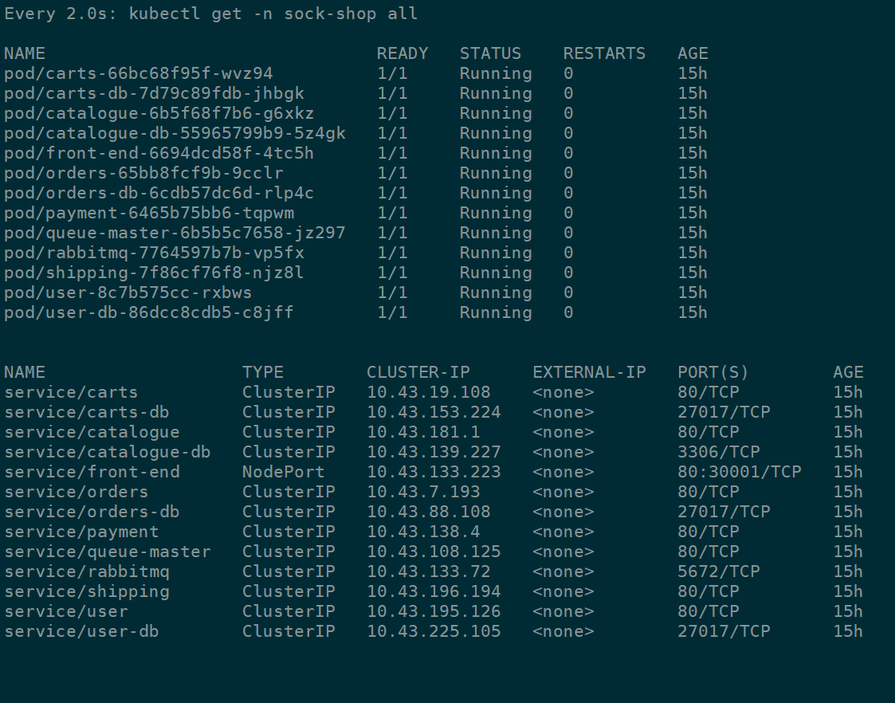
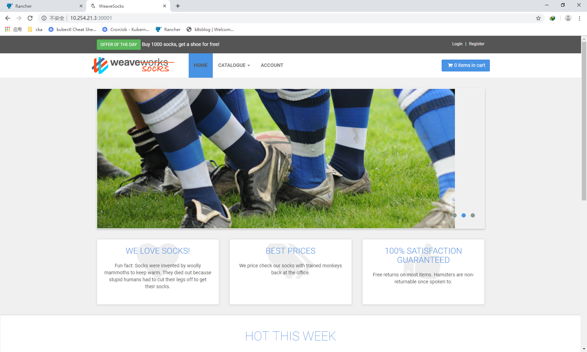

#  rancher k8s cluster on CentOS7


## install docker   

https://docs.docker.com/install/linux/docker-ce/centos/    


```
 yum install -y yum-utils \
  device-mapper-persistent-data \
  lvm2
```

```
yum-config-manager \
    --add-repo \
    https://download.docker.com/linux/centos/docker-ce.repo
```

```
 yum install -y docker-ce docker-ce-cli containerd.io
```


```
systemctl  enable   docker  

systemctl  start    docker  
```


## install rancher


```
docker run -d --restart=unless-stopped -p 80:80 -p 443:443 rancher/rancher
```

##  Open Web-UI


Open Web-UI and setup the k8s-cluster


#  Deploy sock-shop 


##  git clone


```
https://github.com/microservices-demo/microservices-demo.git  


```
##  Deploy


```
kubectl create namespace sock-shop

kubectl apply -f complete-demo.yaml
```








